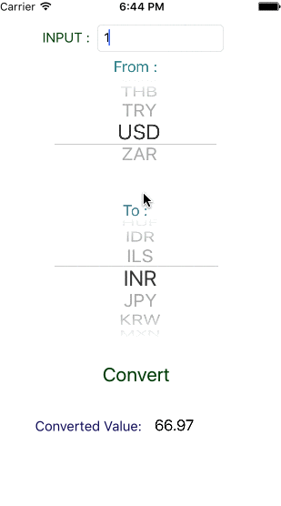

# CurrencyConverter
iOS app written in swift for currency conversion

# Currency Converter Usage #


checkout this screencast on [how to Use]http://recordit.co/xMYhd5CFge

## Usage of API

Get the latest foreign exchange reference rates in JSON format.

```http
GET /latest
Host: api.fixer.io
```

Code to fetch Currency Rates from API.

```swift
    func fetchCurrencyRates() {
        
        if dataTask != nil {
            dataTask?.cancel()
        }
        
        let url = NSURL(string: "https://api.fixer.io/latest")
        
        dataTask = defaultSession.dataTaskWithURL(url!){
            data, response, error in
            
            if let error = error {
                print(error.localizedDescription)
            } else if let httpResponse = response as? NSHTTPURLResponse {
                if httpResponse.statusCode == 200 {
                    self.updateCurrencyRates(data)
                }
            }
        }
        dataTask?.resume()
    }
```
